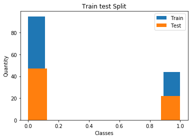

# Dataset Cancer

## Question 1

Le dataset possède 2 classes, la classe 0 est plus représentée que la classe 1. Le test set et le train se partangent équitablement le dataset (50-50).

## Question 2

TODO

## Question 3

TODO

## Question 4

TODO

## Question 5

TODO

## Question 6

TODO

## Question 7

TODO

## Question 8

TODO

# Dataset BCWD

## Question 1

TODO

## Question 4

TODO

## Question 5

TODO

## Question 6

TODO

## Question 7

TODO

## Question 8

TODO

## Question 9

TODO

## Question 10

TODO

# Dataset GOLUB

## Question 1

TODO

## Question 4

TODO

## Question 5

TODO

## Question 6

TODO

## Question 7

TODO

## Question 8

TODO

## Question 9

TODO

## Question 10

TODO
